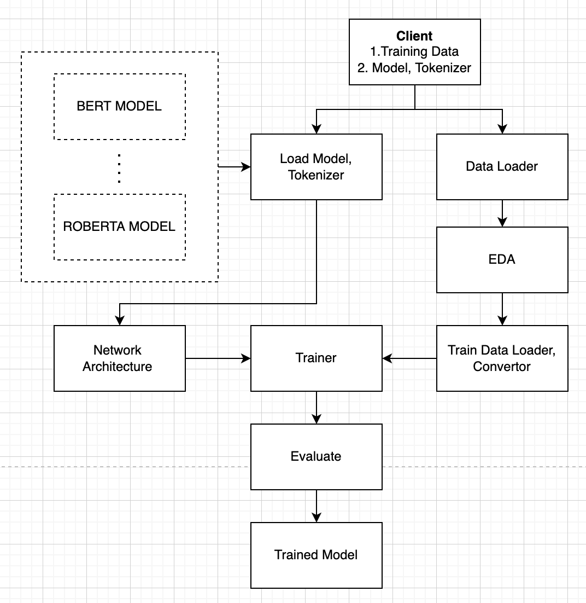

# Short Exercise - Fine tune BERT with layer freezing
Transfer learning has changed the paradigm of many machine learning problems. We saw it being applied to vision problems and how it helped to reach the state of the art technology. 
With similar results now possible in NLP as well with Pretrained transformer-based language models. These are huge models with least a hundred million parameters and a dozen layers.
It is evident from the neural network literature that earlier layers extract universal features, while later ones perform task-specific modeling.<br />
Expanding on this research published in "What Would Elsa Do?" by Lee, Tang, and  Lin https://arxiv.org/pdf/1911.03090.pdf suggests that only a fourth of the actual fourth of the final layers need to be fine-tuned to achieve 90% of the original quality.<br />
In this exercise I try to implement and fine-tune the same by freezing the last 25% of the total layers on Amazon fashion dataset.

**Training can be initiated by:**
```console
python client.py
```
This will execute training based on default parameters set in the config.yaml file.

It does however support custom parameters which can be passed during runtime.

```console
python client.py --help

-m , Model name to be used.
-t ,  Tokenizer name to be used.
-d ,  Training dataset to do finetuning.
-f ,  Layer freezing percentage.
```
for instance to train Bert 
```console
python client.py  -d data/AMAZON_FASHION.json
```
as default parameters already set in config file.

To train RoBerta
```console
python client.py -m roberta-base-uncased -d data/AMAZON_FASHION.json
```

We can extend the similar pattern to try out most of the transformer languauge models by writing similar interfaces.

**Process Flow**
